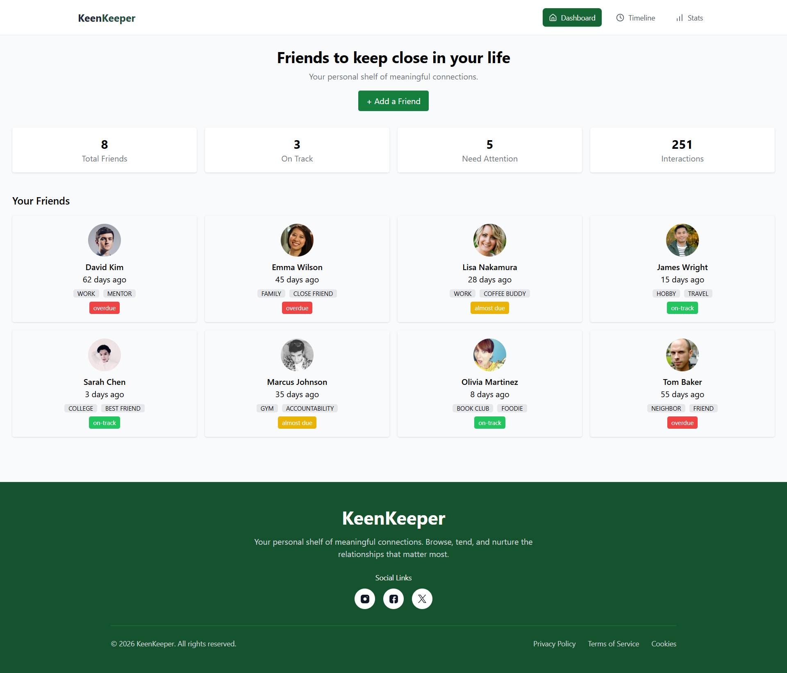
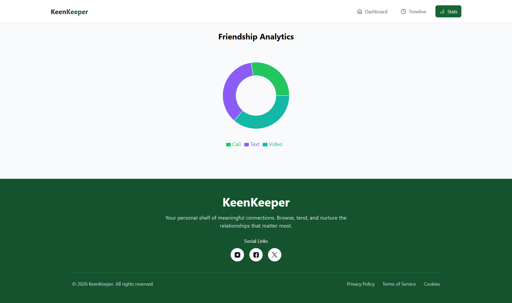
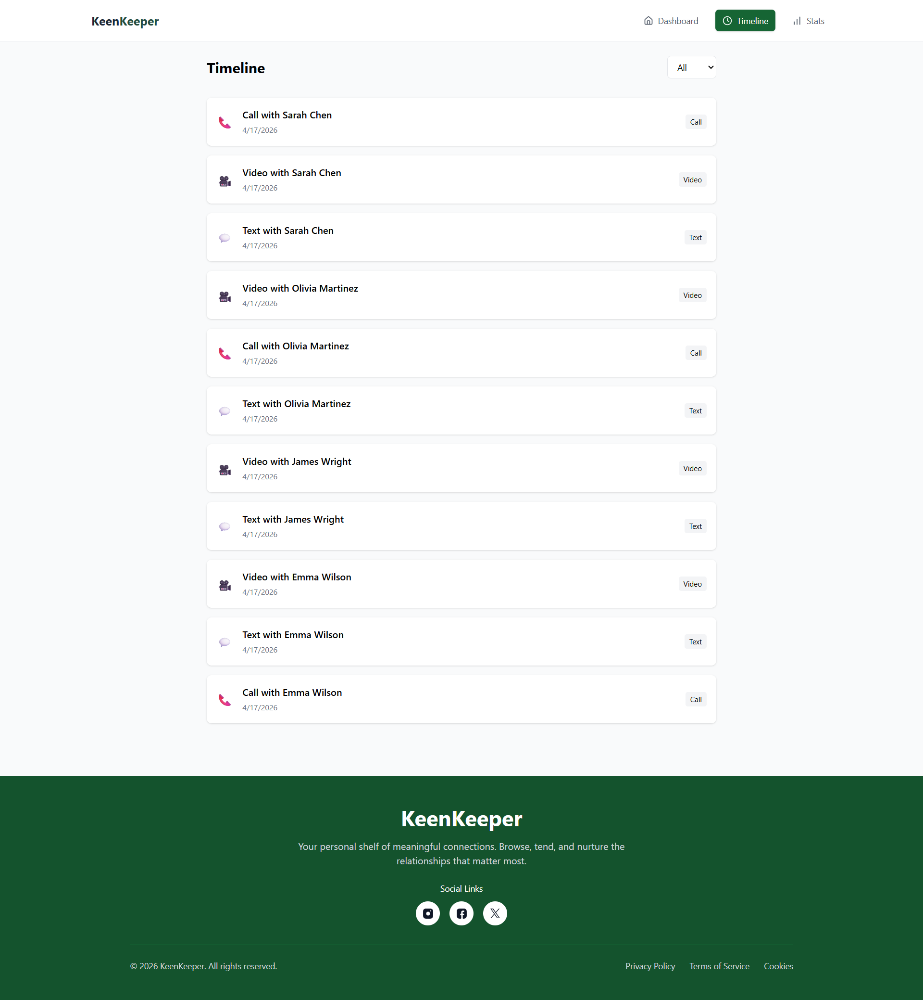
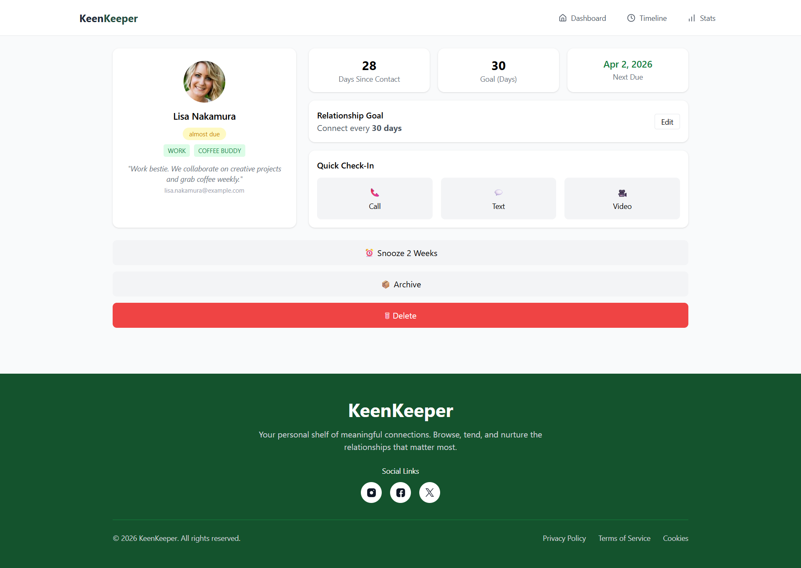

# 🌿 KeenKeeper

<p align="center">
  <b>Your personal relationship management dashboard</b><br/>
  Track interactions, stay connected, and never lose touch again.
</p>

<p align="center">
  
  
  
  
  
</p>

---

## 🚀 Live Demo

👉 **[Visit KeenKeeper](https://your-live-link.vercel.app)**

---


## 📸 Screenshots

### 🏠 Dashboard



### 📊 Analytics



### ⏱️ Timeline



### ⏱️ FrinedsDetails



---

## 🧠 About the Project

KeenKeeper is a modern web app designed to help you maintain meaningful relationships.
It keeps track of your interactions and ensures you stay connected with the people who matter most.

---

## 🛠️ Tech Stack

* ⚛️ **React (Vite)**
* 🎨 **Tailwind CSS**
* 📊 **Recharts**
* 🔥 **React Hot Toast**
* 🧭 **React Router DOM**
* 🧠 **Context API**

---

## ✨ Features

### 📇 Friend Management

* Add and manage friends
* View profile, tags, and details
* Track last interaction status

### 📊 Smart Analytics

* Dynamic pie chart (Call / Text / Video)
* Auto updates when new interactions added

### ⏱️ Timeline Tracking

* Log interactions easily
* Filter by type (Call, Text, Video)
* Clean and minimal UI

### 📱 Fully Responsive

* Mobile, Tablet, Desktop ready
* Hamburger menu for small devices
* Smooth UI experience

---

## ⚙️ Installation & Setup

```bash
git clone https://github.com/your-username/keen-keeper.git
cd keen-keeper
npm install
npm run dev
```

---

## 📈 Future Improvements

* 🔐 Authentication system
* ☁️ Database integration (Firebase / MongoDB)
* 🔔 Smart reminders & notifications
* 📅 Calendar integration

---

## 👨‍💻 Author

Developed with ❤️ by **Saki Al Amin**

---

## ⭐ Support

If you like this project, give it a ⭐ on GitHub!

---
